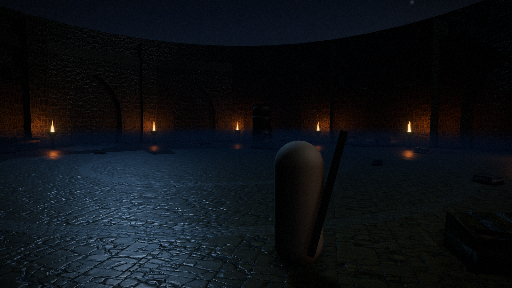

# Rotten Souls

Vertical slice de um Souls-like que roda no navegador, em WebGPU. Uma arena
circular em ruínas à noite, um chefe de quatro metros e meio, e o ciclo
completo: entrar, lutar, morrer, voltar, vencer.



A arena chama **Pátio das Cinzas**. O chefe chama **Vharen, Vigília das Ruínas**.

## Rodar

```bash
pnpm install
pnpm dev
```

Abre em `http://localhost:5173`. Precisa de um navegador com WebGPU; sem ele o
jogo cai sozinho pra WebGL2 com pós-processo reduzido e avisa no canto.

```bash
pnpm build     # bundle de produção em dist/
pnpm typecheck # tsc sem emitir
```

## Comandos

| Tecla | Ação |
|---|---|
| `W` `A` `S` `D` | mover, relativo à câmera |
| `Shift` | correr |
| `Espaço` | esquiva com invencibilidade |
| Mouse esquerdo | golpe leve, encadeia até três |
| Mouse direito | golpe pesado |
| `Q` ou botão do meio | trava e destrava a mira |
| `F3` | painel de perf |
| `F4` | sliders de look dev |

Gamepad também funciona: analógico esquerdo move, direito olha, A esquiva,
X leve, Y pesado, R3 trava a mira, LT corre.

Parâmetros de URL úteis em desenvolvimento: `?mute` abre sem som, `?size=LxA`
força a resolução do buffer, `?vharen` liga o modelo gerado do chefe.

## Stack

TypeScript, Vite, Three.js r185 com `WebGPURenderer`, TSL pro pós-processo,
Rapier pra física, Web Audio API direto. Sem framework de UI: o HUD é HTML e CSS
por cima do canvas.

## Como isso foi feito

Quase tudo que se vê é gerado por código. A arena inteira, incluindo a arcada
gótica de doze vãos com arco ogival vazado, os vãos arruinados, os contrafortes,
o piso em anéis e a escadaria, sai de um kit paramétrico em `src/world/kit`.
Nenhum modelo de arquitetura foi importado.

O som também: não há um único arquivo de áudio no projeto. Vento, passo, corte,
impacto, rugido e a música do chefe são sintetizados na Web Audio API, o que sai
mais leve que qualquer amostra comprimida e responde a parâmetro.

As texturas são CC0 do [ambientCG](https://ambientcg.com), o céu noturno é do
[Poly Haven](https://polyhaven.com), e os personagens provisórios vêm da
Universal Animation Library do [Quaternius](https://quaternius.com), também CC0.
Créditos completos em `public/assets/*/CREDITOS.md`.

## Orçamento

Medido a cada marco em [`docs/perf.md`](docs/perf.md).

| Item | Medido | Limite |
|---|---|---|
| Frame time | 7,7 ms | 16 ms |
| Draw calls | 75 | 300 |
| Triângulos | 70 mil | 1,5 milhão |
| Download | 9,8 MB | 60 MB |
| Luzes com sombra em tempo real | 1 | 1 |

## Estrutura

```
src/
  core/       renderer, loop, input, assets, física, áudio, pós-processo
  world/      arena, iluminação, kit modular, névoa e fogo
  entities/   personagem, jogador, chefe, combate, câmera, animação
  ui/         HUD
  debug/      painel de perf, sliders, captura de tela
scripts/      geração de imagem, download de textura, otimização de asset
docs/         perf, decisões, direção de arte, screenshots
```

## Documentação

- [`docs/decisions.md`](docs/decisions.md) tem uma linha por decisão, com o
  motivo. Inclui os becos sem saída, que costumam ser mais úteis que os acertos.
- [`docs/perf.md`](docs/perf.md) tem os números de cada marco e como foram medidos.
- [`docs/art-direction.md`](docs/art-direction.md) tem as regras do look.
- `CLAUDE.md` é o briefing original do projeto.

## O que ainda não está pronto

- O modelo definitivo do chefe existe e está bonito parado, mas as animações da
  biblioteca CC0 ainda deformam o esqueleto dele. Fica atrás de `?vharen` e o
  padrão usa o provisório, que anima certo.
- Texturas em KTX2, que reduziriam a memória de vídeo.
- Bloqueio e aparo, cortados quando a arma virou montante sem escudo.

## Licença

Código sob MIT. Os assets de terceiros seguem as licenças dos respectivos
autores, todas CC0, com origem registrada nos arquivos de crédito.
